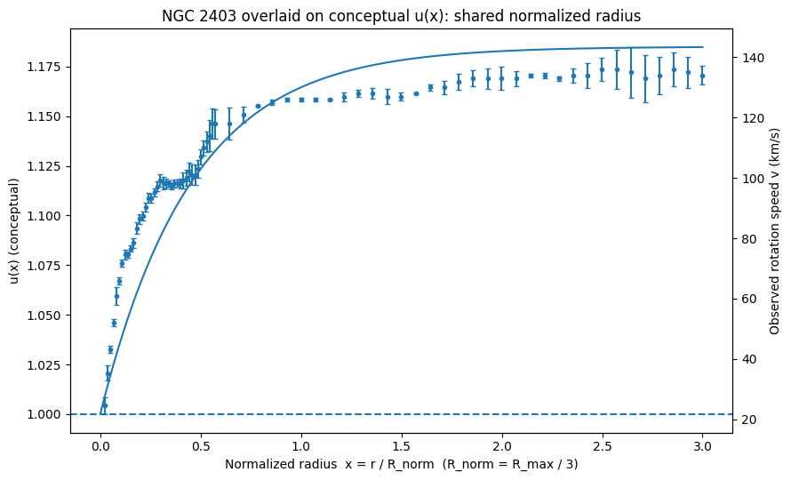

> **Status: Archived Exploratory Illustration (Non-active)**
>
> This document records an early qualitative comparison between a bounded conceptual  
> propagation modifier \(u(x)\) and the normalized rotation-curve structure of NGC 2403.
>
> - This comparison is **illustrative only** and does **not** constitute a dynamical fit,
>   explanatory model, or evidence for modifying dark-matter requirements.
> - The original exploratory intent was limited to **inner-galaxy inference and structure**
>   (central few kiloparsecs), where baryonic modeling uncertainty, plasma effects,
>   and non-circular motions are known to be relevant.
> - The comparison is **not applicable** to outer flat rotation curves or
>   cluster-scale gravitational lensing, which remain outside UETC’s current scope.
>
> This file is preserved for **transparency and historical continuity** within the
> development of the UETC framework.

# NGC 2403: Normalized-Radius Overlay on Conceptual u(x) (Working Hypothesis)

## Status and intent

This is an **illustrative shape comparison**, not a fitted model.

- No parameter optimization
- No χ² minimization
- No uniqueness claim
- Intended only to test whether a simple, bounded u(x) curve can track the **qualitative radial transition structure** seen in a real rotation curve when viewed in normalized coordinates.

## Normalization

We define the dimensionless radius:

$$
x \equiv \frac{r}{R_{\text{norm}}}
\qquad \text{with} \qquad
R_{\text{norm}} = \frac{R_{\max}}{3}
$$

This normalization is a convenience choice for comparing the inner rise, knee, and outer behavior on a shared dimensionless axis. It is not unique.

## Overlay figure

- Left axis: conceptual $u(x)$ (dimensionless)
- Right axis: observed rotation speed $v(r)$ for NGC 2403 (km/s)

## Interpretation

The overlay suggests that the rise and saturation behavior of a bounded u(x) response can be structurally compatible with the radial transition features of the NGC 2403 rotation curve when plotted against a shared normalized radius.

This is **not** presented as evidence of correctness or a precision explanation, but as a rationale for the next step: applying the same normalized-radius methodology across a set of low-inclination galaxies to derive an average u(x) shape for falsifiable testing.
